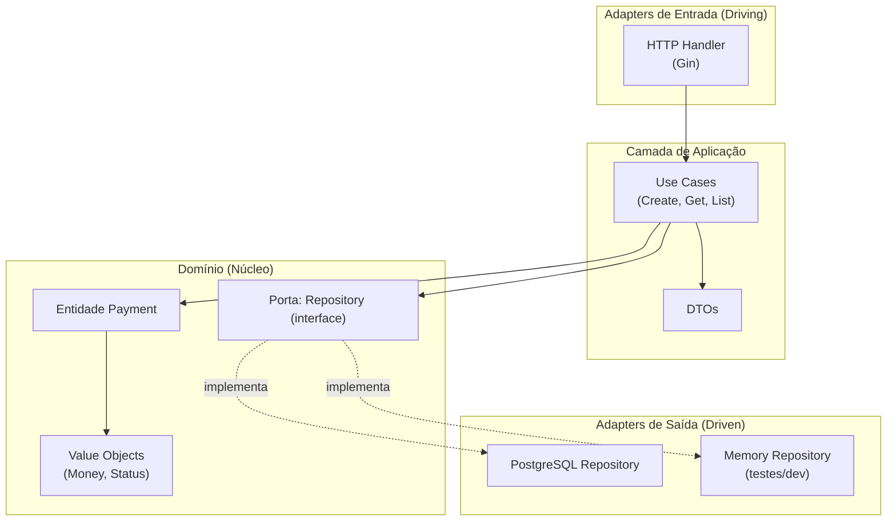
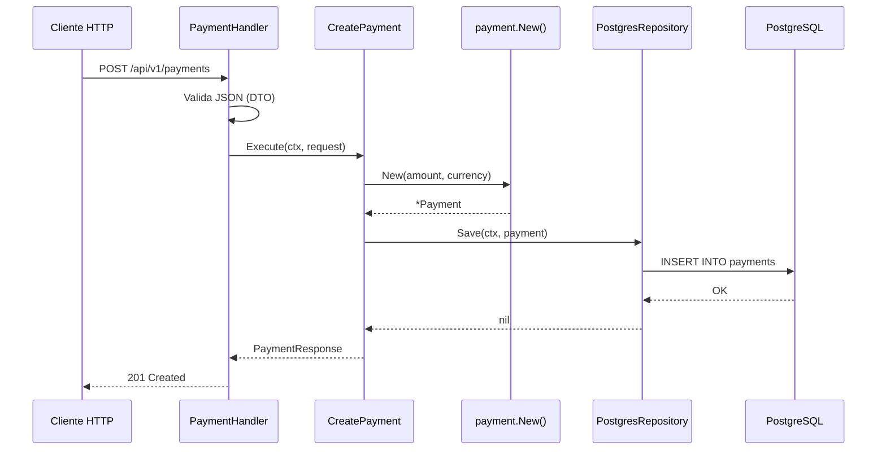
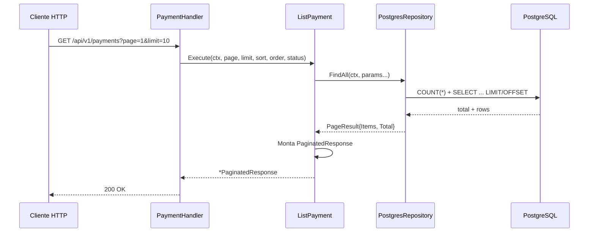
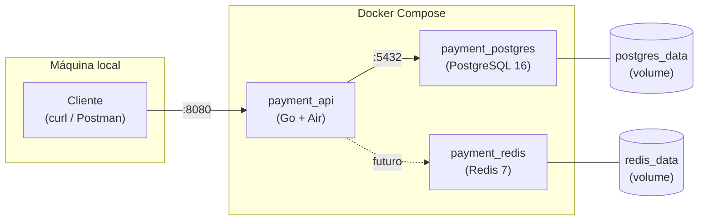
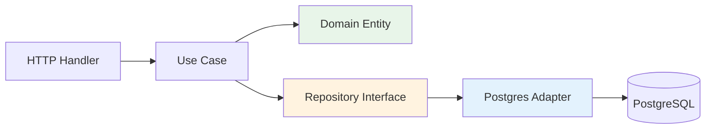

# Payment Service

API REST em Go para gerenciamento de pagamentos, construída com **Domain-Driven Design (DDD)** e **Arquitetura Hexagonal** (Ports & Adapters).

---

## Sumário

- [Visão geral](#visão-geral)
- [Stack tecnológica](#stack-tecnológica)
- [Arquitetura](#arquitetura)
- [Estrutura de pastas](#estrutura-de-pastas)
- [Fluxogramas](#fluxogramas)
- [Endpoints da API](#endpoints-da-api)
- [Como rodar](#como-rodar)
- [Migrations, factories e seeders](#migrations-factories-e-seeders)
- [Variáveis de ambiente](#variáveis-de-ambiente)
- [Banco de dados](#banco-de-dados)
- [Docker](#docker)

---

## Visão geral

O **Payment Service** expõe uma API HTTP para criar, consultar e listar pagamentos. Cada pagamento possui valor (`amount`), moeda (`currency`) e status (`pending`, `completed`, `failed`).

A aplicação persiste os dados no **PostgreSQL** (via adapter `pgx`) e está preparada para integração futura com **Redis** (cache/sessões).

---

## Stack tecnológica

| Tecnologia | Uso |
|---|---|
| **Go 1.26** | Linguagem principal |
| **Gin** | Framework HTTP |
| **pgx/v5** | Driver PostgreSQL |
| **golang-migrate** | Migrations versionadas |
| **PostgreSQL 16** | Persistência de pagamentos |
| **Redis 7** | Infraestrutura disponível (ainda não integrada na aplicação) |
| **Docker Compose** | Orquestração de containers |
| **Air** | Hot-reload em desenvolvimento |

---

## Arquitetura

O projeto segue **Arquitetura Hexagonal** com separação clara de responsabilidades:



### Princípios

| Camada | Responsabilidade | Depende de |
|---|---|---|
| **Domain** | Regras de negócio, entidades, value objects, contratos (ports) | Nada externo |
| **Application** | Orquestração via use cases e DTOs | Domain |
| **Infrastructure** | HTTP, banco de dados, config | Application + Domain |

> O domínio e a aplicação **nunca** importam Gin ou PostgreSQL diretamente. Apenas os entrypoints em `cmd/` fazem o wiring das dependências (composition root).

---

## Estrutura de pastas

```
payment_service/
├── cmd/
│   ├── api/main.go                          # Composition root da API
│   ├── migrate/main.go                      # CLI de migrations
│   └── seed/main.go                         # CLI de seeders
├── db/migrations/                           # SQL versionado (golang-migrate)
├── internal/
│   ├── domain/payment/                      # Núcleo do domínio
│   │   ├── payment.go                       # Entidade
│   │   ├── money.go                         # Value object
│   │   ├── status.go                        # Value object
│   │   ├── page.go                          # Resultado paginado
│   │   ├── errors.go
│   │   └── repository.go                    # Porta (interface)
│   ├── application/
│   │   ├── dto/                             # Objetos de transferência
│   │   └── usecase/                         # Casos de uso
│   ├── database/
│   │   ├── migrate/                         # Runner de migrations
│   │   ├── factory/                         # Factories de dados fake
│   │   └── seeder/                          # Seeders
│   └── infrastructure/
│       ├── config/
│       ├── http/                            # Adapter HTTP (Gin)
│       └── persistence/
│           ├── postgres/                    # Adapter PostgreSQL (produção)
│           └── memory/                      # Adapter in-memory
├── docker-compose.yml                       # Orquestração (produção)
├── docker-compose.override.yml              # Hot-reload (dev, auto-carregado)
├── Dockerfile                               # Build de produção
├── Dockerfile.dev                           # Build de desenvolvimento (Air)
├── .air.toml                                # Configuração do hot-reload
└── Makefile                                 # Atalhos (migrate, seed, run)
```

---

## Fluxogramas

### Fluxo de uma requisição — Criar pagamento



### Fluxo de uma requisição — Listar pagamentos



### Infraestrutura Docker



### Ciclo de dependências (Hexagonal)



---

## Endpoints da API

| Método | Rota | Descrição |
|---|---|---|
| `GET` | `/ping` | Health check |
| `POST` | `/api/v1/payments` | Criar pagamento |
| `GET` | `/api/v1/payments/:id` | Buscar pagamento por ID |
| `GET` | `/api/v1/payments` | Listar pagamentos (paginado) |

### Exemplos

**Health check**

```bash
curl http://localhost:8080/ping
# {"message":"pong"}
```

**Criar pagamento**

```bash
curl -X POST http://localhost:8080/api/v1/payments \
  -H "Content-Type: application/json" \
  -d '{"amount": 1000, "currency": "BRL"}'
```

```json
{
  "id": "a1b2c3d4-...",
  "amount": 1000,
  "currency": "BRL",
  "status": "pending",
  "created_at": "2026-07-06T22:53:41Z"
}
```

**Buscar por ID**

```bash
curl http://localhost:8080/api/v1/payments/{id}
```

**Listar (com paginação)**

```bash
curl "http://localhost:8080/api/v1/payments?page=1&limit=10&sort=created_at&order=desc&status=pending"
```

```json
{
  "data": [
    {
      "id": "a1b2c3d4-...",
      "amount": 1000,
      "currency": "BRL",
      "status": "pending",
      "created_at": "2026-07-06T22:53:41Z"
    }
  ],
  "page": "1",
  "limit": "10",
  "total": 25,
  "total_pages": 3
}
```

> `total` e `total_pages` refletem o **total de registros no banco** (com filtros aplicados), não apenas os itens da página atual.

#### Query params da listagem

| Param | Padrão | Descrição |
|---|---|---|
| `page` | `1` | Página atual |
| `limit` | `10` | Itens por página |
| `sort` | `created_at` | Coluna de ordenação (`id`, `amount`, `currency`, `status`, `created_at`) |
| `order` | `desc` | Direção (`asc` ou `desc`) |
| `status` | — | Filtro opcional por status (`pending`, `completed`, `failed`) |

---

## Como rodar

### Pré-requisitos

- [Docker](https://docs.docker.com/get-docker/) e Docker Compose
- (Opcional) Go 1.26+ para rodar fora do Docker

### Desenvolvimento (com hot-reload)

```bash
cp .env.example .env
docker compose up
```

O arquivo `docker-compose.override.yml` é carregado automaticamente e configura:
- **Air** para recompilar ao salvar arquivos `.go`
- Volume montado com o código local
- Cache de módulos Go

```bash
# Ver logs da API
docker compose logs -f api
```

> Se o build falhar com `error obtaining VCS status`, o `.air.toml` já inclui `-buildvcs=false` para contornar isso dentro do Docker.

### Produção (build otimizado)

```bash
docker compose -f docker-compose.yml up --build -d
```

Usa o `Dockerfile` multi-stage (imagem Alpine enxuta), sem hot-reload.

### Rodar localmente (sem Docker na API)

```bash
# Subir apenas Postgres e Redis
docker compose up postgres redis -d

# Configurar env vars
cp .env.example .env

# Aplicar migrations e popular dados (opcional)
make migrate-up
make seed

# Rodar a API
go run ./cmd/api
```

---

## Migrations, factories e seeders

### Migrations

Schema gerenciado por **golang-migrate** em `db/migrations/`. A API executa `migrate up` automaticamente ao iniciar.

```bash
make migrate-up          # aplicar migrations
make migrate-down        # reverter tudo
go run ./cmd/migrate version   # ver versão atual
go run ./cmd/migrate steps -1  # reverter 1 migration
```

### Factories

Gera pagamentos fake para testes e seeders:

```go
factory := factory.NewPaymentFactory()

p := factory.Make()

p := factory.NewPaymentFactory().
    WithAmount(5000).
    WithCurrency("BRL").
    WithStatus(payment.StatusCompleted).
    Make()

payments := factory.NewPaymentFactory().MakeMany(10)
```

### Seeders

```bash
make seed                # insere 25 pagamentos
make seed-fresh          # limpa a tabela e reinsere 25 pagamentos

go run ./cmd/seed -count=50
go run ./cmd/seed -count=25 -fresh
```

---

## Variáveis de ambiente

| Variável | Padrão | Descrição |
|---|---|---|
| `PORT` | `8080` | Porta da API |
| `APP_PORT` | `8080` | Porta exposta no host (Docker) |
| `POSTGRES_HOST` | `localhost` | Host do PostgreSQL |
| `POSTGRES_PORT` | `5432` | Porta do PostgreSQL |
| `POSTGRES_USER` | `payment` | Usuário do banco |
| `POSTGRES_PASSWORD` | `payment` | Senha do banco |
| `POSTGRES_DB` | `payment_db` | Nome do banco |
| `REDIS_HOST` | `localhost` | Host do Redis |
| `REDIS_PORT` | `6379` | Porta do Redis |
| `SEED_COUNT` | `25` | Quantidade padrão de registros no seeder |

> Dentro do Docker Compose, `POSTGRES_HOST=postgres` e `REDIS_HOST=redis` (nomes dos serviços na rede interna).

---

## Banco de dados

O schema é versionado em `db/migrations/`:

```sql
CREATE TABLE payments (
    id          UUID PRIMARY KEY,
    amount      BIGINT NOT NULL CHECK (amount > 0),
    currency    VARCHAR(3) NOT NULL,
    status      VARCHAR(20) NOT NULL,
    created_at  TIMESTAMPTZ NOT NULL DEFAULT NOW()
);
```

Os dados ficam no volume Docker `postgres_data` e **persistem** entre restarts da API.

```bash
# Acessar o banco
docker exec -it payment_postgres psql -U payment -d payment_db

# Verificar migrations
docker exec -it payment_postgres psql -U payment -d payment_db -c "SELECT * FROM schema_migrations;"
```

---

## Docker

### Serviços

| Serviço | Container | Porta | Descrição |
|---|---|---|---|
| `api` | `payment_api` | 8080 | API Go |
| `postgres` | `payment_postgres` | 5432 | Banco de dados |
| `redis` | `payment_redis` | 6379 | Cache (futuro) |

### Comandos úteis

```bash
# Subir tudo
docker compose up -d

# Rebuild apenas a API
docker compose up -d --build api

# Parar tudo
docker compose down

# Parar e remover volumes (apaga dados!)
docker compose down -v
```

### Modos de build

| Arquivo | Uso | Hot-reload |
|---|---|---|
| `Dockerfile.dev` + `override` | Desenvolvimento local | Sim (Air) |
| `Dockerfile` | Produção | Não |

---

## Próximos passos

- [ ] Integrar Redis (cache de consultas, rate limiting)
- [ ] Use cases: completar/falhar pagamento
- [ ] Endpoint DELETE exposto na API
- [ ] Testes unitários e de integração
- [ ] CI/CD pipeline
